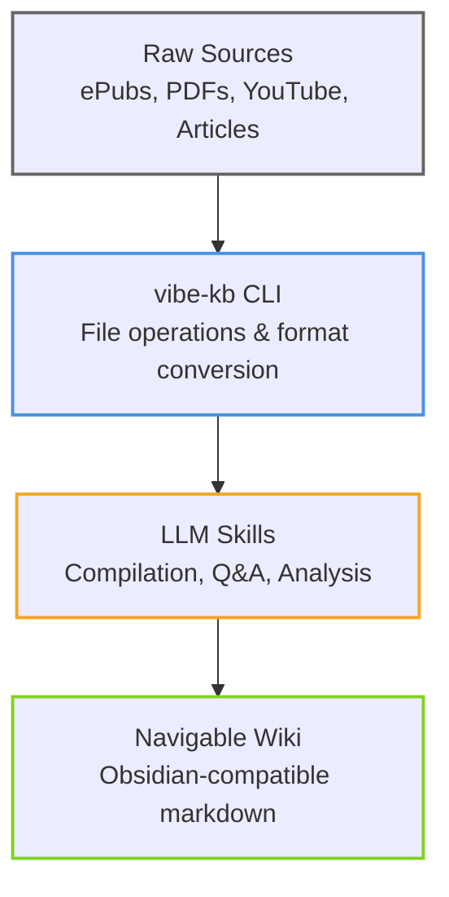
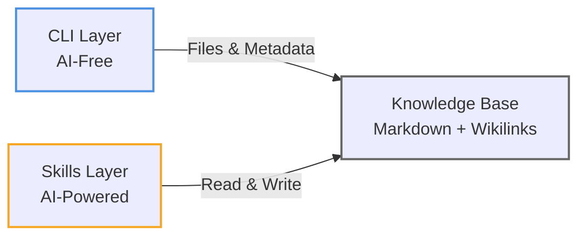
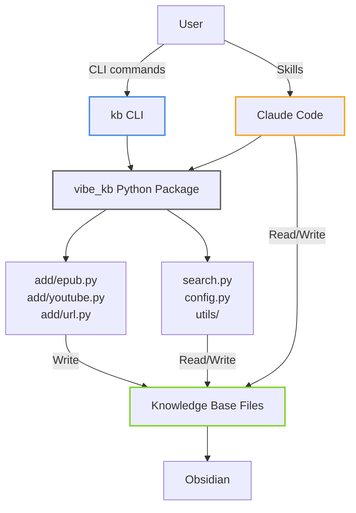
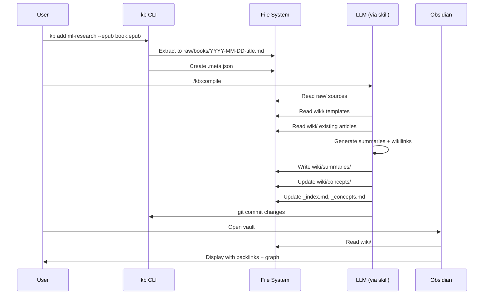

# vibe-kb

**Build an LLM-powered personal knowledge base from your research materials.**

vibe-kb turns raw sources—ePubs, articles, YouTube videos, academic papers—into a navigable markdown wiki with intelligent wikilinks and backlinks. Query your knowledge base conversationally, generate insights, and let the LLM organize your research for you.

Inspired by Andrej Karpathy's [LLM knowledge bases](https://x.com/karpathy/status/2039805659525644595) concept.

---

## What is vibe-kb?

A two-layer system for building personal knowledge bases:

1. **CLI (AI-free)**: Converts sources to markdown, manages files, handles search
2. **Skills (AI-powered)**: Compiles sources into wiki articles, answers questions, maintains quality



**Key features:**
- 📚 **Multi-format ingestion**: ePubs, YouTube transcripts, web articles, PDFs
- 🔗 **Intelligent linking**: LLM creates `[[wikilinks]]` between concepts automatically
- 💬 **Conversational interface**: Ask questions, get answers with source citations
- 📊 **Multiple outputs**: Markdown reports, presentation slides, visualizations
- 🔄 **Obsidian integration**: View and navigate your wiki with backlinks and graph view

The wiki lives in Obsidian. You rarely edit it manually—it's the LLM's domain.

---

## Quick Start

Get a knowledge base running in 2 minutes:

### 1. Install

```bash
# Clone and install
git clone git@github.com:mlgruby/vibe-kb.git
cd vibe-kb
uv sync
uv tool install -e .
```

**Requirements:** Python 3.11+, [uv](https://docs.astral.sh/uv/)

### 2. Install Claude Code Skills

```bash
# Link skills to Claude Code
ln -s "$(pwd)/skills" ~/.claude/skills/vibe-kb

# Or manually copy skills
cp -r skills/* ~/.claude/skills/
```

Verify skills are available:
```bash
# In Claude Code, type:
/kb
# You should see autocomplete suggestions for kb:create, kb:add-source, etc.
```

### 3. Create Your First Knowledge Base

```bash
# Create a knowledge base
kb create ml-research --vault-path ~/obsidian-vault

# Or use the conversational skill in Claude Code
/kb:create
```

### 4. Add Sources

```bash
# Add an ePub book
kb add ml-research --epub path/to/book.epub

# Add a YouTube video
kb add ml-research --youtube "https://youtube.com/watch?v=..."

# Or use the skill for guided adding
/kb:add-source
```

### 5. Compile & Query

```bash
# Use Claude Code skills for AI-powered operations
/kb:compile    # Compile sources into wiki with wikilinks
/kb:research   # Ask questions against your knowledge base
```

### What Just Happened?

1. **CLI created** a directory structure in your Obsidian vault:
   ```
   ~/obsidian-vault/knowledge-bases/ml-research/
   ├── raw/      # Your source materials
   ├── wiki/     # LLM-generated articles
   └── outputs/  # Research results
   ```

2. **Source ingestion** converted your materials to markdown

3. **LLM compilation** (via `/kb:compile`) created:
   - Summaries of each source with `[[wikilinks]]`
   - Concept articles that tie sources together
   - Index files for navigation

4. **You can now:**
   - View the wiki in Obsidian with backlinks
   - Query it conversationally with `/kb:research`
   - Generate slides, charts, and reports

---

## Core Concepts

### Two-Layer Architecture

vibe-kb separates concerns into two distinct layers:



**CLI Layer (AI-free Python):**
- Converts ePubs → markdown
- Extracts YouTube transcripts
- Fetches web articles
- Searches wiki content
- Manages configuration

**Skills Layer (LLM-powered):**
- Compiles sources into wiki articles
- Creates intelligent wikilinks
- Answers research questions
- Generates outputs (slides, charts)
- Maintains wiki health

**Why this separation?** 
- CLI works offline, no API keys needed
- Knowledge base format is portable (any AI tool can use it)
- Clear boundary: file operations vs. reasoning

### Knowledge Base Structure

Each knowledge base follows this layout:

```
knowledge-bases/<name>/
├── raw/                          # Your source materials
│   ├── articles/                 # Web articles (markdown)
│   ├── papers/                   # Academic papers (PDF)
│   ├── books/                    # ePub books
│   ├── videos/                   # YouTube transcripts
│   ├── repos/                    # Code repositories
│   └── datasets/                 # Data files
│
├── wiki/                         # LLM-compiled knowledge
│   ├── _index.md                 # Master index
│   ├── _concepts.md              # Concept hierarchy
│   ├── _sources.md               # Source catalog
│   ├── concepts/                 # Core concept articles
│   ├── summaries/                # Source summaries
│   │   ├── articles/
│   │   ├── papers/
│   │   ├── books/
│   │   └── videos/
│   └── topics/                   # Thematic collections
│
├── outputs/                      # Research results
│   └── YYYY-MM-DD-description.{md,slides.md,png}
│
└── .kbconfig                     # Metadata
```

### How Compilation Works

When you run `/kb:compile`, the LLM:

1. **Scans** `raw/` for new or modified sources
2. **Reads** each source and the wiki templates
3. **Generates** summaries (250-500 words) following the template
4. **Creates** `[[wikilinks]]` to concepts mentioned in the source
5. **Updates** existing concept articles to reference the new source
6. **Maintains** index files (`_index.md`, `_concepts.md`, `_sources.md`)
7. **Commits** changes to git

### Wikilinks & Backlinks

The LLM actively manages Obsidian-style `[[wikilinks]]`:

```markdown
# Example: A compiled summary

## Summary
This paper introduces Flash Attention, an optimization for 
[[Attention Mechanism|attention mechanisms]] in [[Transformers]].
The technique builds on [[Multi-Head Attention]] by...

## Key Concepts
- [[Attention Mechanism]] - memory-efficient implementation
- [[Transformers]] - architectural foundation
- [[GPU Optimization]] - kernel-level improvements
```

**Obsidian displays:**
- Clickable links between articles
- Backlinks panel showing all references
- Graph view of concept relationships

**The LLM follows backlinks** when new sources arrive:
- New paper on "Flash Attention 2" added
- LLM reads `[[Attention Mechanism]]` article
- Follows backlinks to find related articles
- Updates them to reference the new paper

---

## Usage Guide

### CLI Commands Reference

#### Knowledge Base Management

```bash
# Create a new knowledge base
kb create <name> [--vault-path PATH] [--topic TOPIC]

# Show statistics
kb stats <name> [--vault-path PATH]

# List all knowledge bases (coming soon)
kb list [--vault-path PATH]
```

**Example:**
```bash
kb create ml-research --vault-path ~/obsidian-vault --topic "Machine Learning"
kb stats ml-research
```

#### Adding Sources

```bash
# Add an ePub book
kb add <name> --epub <path>

# Add YouTube video
kb add <name> --youtube <url>

# Add web article (coming soon)
kb add <name> --url <url>

# Add arXiv paper (coming soon)
kb add <name> --arxiv <query> [--limit N]

# Auto-detect file type (coming soon)
kb add <name> --file <path>
```

**Example:**
```bash
kb add ml-research --epub "Attention-Is-All-You-Need.epub"
kb add ml-research --youtube "https://youtube.com/watch?v=XowwKOAWYoQ"
```

#### Search

```bash
# Search wiki content
kb search <name> <query> [--case-sensitive]
```

**Example:**
```bash
kb search ml-research "transformer architecture"
kb search ml-research "BERT" --case-sensitive
```

### Skills Workflow

Skills provide conversational interfaces for AI-powered operations:

#### `/kb:create` — Initialize Knowledge Base

**What it does:** Conversational KB creation with guided setup

**Workflow:**
1. Asks for KB name and research topic
2. Optionally imports existing sources
3. Creates directory structure
4. Explains next steps

**Example conversation:**
```
You: /kb:create

Claude: What would you like to name this knowledge base?

You: ml-research

Claude: What's the research topic?

You: Machine learning and deep learning fundamentals

Claude: Do you have existing sources to import? (ePubs, PDFs, etc.)

You: Yes, I have some ePubs in ~/Downloads/ml-books/

Claude: [scans directory, finds 5 ePubs]
        Found 5 ePub files. Import all?

You: Yes

Claude: ✓ Created ml-research knowledge base
        ✓ Imported 5 books to raw/books/
        
        Next steps:
        1. Run /kb:compile to generate wiki articles
        2. Use /kb:research to query your knowledge base
```

#### `/kb:add-source` — Add Materials

**What it does:** Guided source addition with validation

**Workflow:**
1. Asks which KB to add to
2. Asks source type (epub, youtube, url, file)
3. Validates source
4. Optionally compiles immediately

**Example:**
```
You: /kb:add-source

Claude: Which knowledge base?

You: ml-research

Claude: What type of source? (epub/youtube/url/file)

You: youtube

Claude: YouTube video URL?

You: https://youtube.com/watch?v=XowwKOAWYoQ

Claude: ✓ Extracted transcript: "Attention Is All You Need (Paper Explained)"
        ✓ Saved to raw/videos/
        
        Compile this into the wiki now?

You: Yes

Claude: [runs compilation...]
```

#### `/kb:compile` — Compile Sources into Wiki

**What it does:** Transforms raw sources into navigable wiki

**Workflow:**
1. Scans for new/modified sources
2. Reads templates and existing wiki
3. Generates summaries with wikilinks
4. Previews structural changes (new concepts, reorganizations)
5. Applies approved changes
6. Commits to git

**What gets created:**
- Summary articles in `wiki/summaries/<type>/`
- Concept articles in `wiki/concepts/` (when concept appears 3+ times)
- Updated index files (`_index.md`, `_concepts.md`, `_sources.md`)
- Wikilinks between related content

#### `/kb:research` — Query Knowledge Base

**What it does:** Multi-turn Q&A against your knowledge base

**Workflow:**
1. Asks research question
2. Reads index files to find relevant articles
3. Follows wikilinks for context
4. Generates answer with source citations
5. Offers output formats (markdown, slides, charts)
6. Optionally files valuable outputs back into wiki

**Example:**
```
You: /kb:research

Claude: Which knowledge base?

You: ml-research

Claude: What's your research question?

You: How do transformers differ from RNNs in handling long sequences?

Claude: [reads relevant articles...]

        ## Transformers vs RNNs for Long Sequences

        Transformers handle long sequences fundamentally differently:

        **Parallel Processing** ([[Transformers]])
        - Process entire sequence simultaneously
        - No sequential bottleneck like RNNs
        - Scales to sequences of 1000+ tokens

        **Attention Mechanism** ([[Self-Attention]])
        - Direct connections between any positions
        - RNNs must pass info through hidden states
        - Reduces gradient path length

        **Memory Complexity** ([[Computational Efficiency]])
        - O(n²) memory for attention
        - RNNs use O(n) but suffer from vanishing gradients
        
        Sources: [[Attention Is All You Need]], [[RNN Limitations]]
        
        Would you like this as:
        1. Markdown report
        2. Marp slides
        3. Comparison chart

You: Slides

Claude: ✓ Generated slides: outputs/2026-04-16-transformers-vs-rnns.slides.md
        Open in Obsidian with Marp plugin to present
```

#### `/kb:health-check` — Wiki Maintenance (Coming Soon)

**What it does:** Identifies and fixes wiki issues

**Checks for:**
- Orphaned articles (no backlinks)
- Dead wikilinks
- Stale summaries
- Missing metadata
- Inconsistent claims across articles

### Example Research Workflows

#### Workflow 1: Building a Literature Review

```bash
# 1. Create KB for your research area
/kb:create
> Name: neural-architecture-search
> Topic: Neural Architecture Search and AutoML

# 2. Bulk import papers
kb add neural-architecture-search --arxiv "neural architecture search" --limit 20

# 3. Add key books
kb add neural-architecture-search --epub "AutoML-Methods-Systems.epub"

# 4. Compile into wiki
/kb:compile

# 5. Generate literature review
/kb:research
> Question: Summarize the evolution of NAS techniques from 2017-2024
> Format: Markdown report with timeline

# 6. Export for paper
# The generated report in outputs/ can be copied into your LaTeX/Word doc
```

#### Workflow 2: Learning a New Framework

```bash
# 1. Create KB
/kb:create
> Name: react-deep-dive
> Topic: React and modern frontend development

# 2. Add video tutorials
kb add react-deep-dive --youtube "https://youtube.com/playlist?list=..."

# 3. Add official docs (as markdown)
kb add react-deep-dive --url "https://react.dev/learn"

# 4. Compile
/kb:compile

# 5. Ask specific questions while coding
/kb:research
> Question: How does useEffect cleanup work with dependencies?
> [Get answer with examples from multiple sources]

/kb:research
> Question: What are the trade-offs between Context API and Redux?
```

#### Workflow 3: Cross-Source Synthesis

```bash
# Scenario: You have 10 books on LLMs, want to understand "emergent abilities"

# 1. Sources already in KB
kb stats llm-research
> Sources: 10 books, 15 papers, 8 videos

# 2. Ask synthesis question
/kb:research
> Question: Compare how different authors define and explain emergent abilities in LLMs

# 3. Get answer that cites all relevant sources with wikilinks
# 4. Generate comparison chart
> Format: Matplotlib comparison chart

# 5. File output back into wiki
> Claude: This synthesis might be valuable for future queries. 
>         Add to wiki as a concept article?
> You: Yes
> Claude: ✓ Created wiki/concepts/emergent-abilities.md with backlinks
```

---

## Obsidian Integration

vibe-kb generates Obsidian-compatible markdown with wikilinks, backlinks, and frontmatter. Your knowledge base becomes a fully navigable wiki.

### Vault Setup

#### Option 1: Use Existing Vault

```bash
# Point to your existing Obsidian vault
kb create my-kb --vault-path ~/Dropbox/obsidian-vault

# Knowledge bases live in a subfolder
# ~/Dropbox/obsidian-vault/knowledge-bases/my-kb/
```

Your personal notes remain separate from knowledge bases.

#### Option 2: Dedicated Vault

```bash
# Create a dedicated vault for knowledge bases
mkdir ~/knowledge-vault
kb create my-kb --vault-path ~/knowledge-vault

# Open in Obsidian: Settings → Open another vault → ~/knowledge-vault
```

#### Setting Default Vault Path

Avoid typing `--vault-path` every time:

```bash
# Set environment variable
export KB_VAULT_PATH="$HOME/obsidian-vault"

# Or create a config file (coming soon)
echo 'vault_path: ~/obsidian-vault' > ~/.kbconfig
```

### Viewing Your Wiki in Obsidian


#### Navigation Entry Points

1. **`_index.md`** — Master index of all articles
   - Lists all concept articles
   - Lists all source summaries by type
   - Recently added sources

2. **`_concepts.md`** — Concept hierarchy
   - Concepts sorted by backlink count
   - Shows which concepts are most connected
   - Entry point for topical exploration

3. **`_sources.md`** — Source catalog
   - All sources with summaries
   - Sorted by date added
   - Filterable by type (books, papers, videos)

### Using Obsidian Features

#### Backlinks Panel

Every article shows **incoming links** (what references this):

```
📄 Attention Mechanism

Backlinks (12):
  • Transformers → "uses self-attention mechanism"
  • BERT → "bidirectional attention"
  • Flash Attention → "optimized attention implementation"
  • GPT Architecture → "masked attention layers"
  ...
```

**Why this matters:** Follow backlinks to see how concepts connect across sources.

#### Graph View

Visual representation of your knowledge base:

```
Cmd/Ctrl+G → Opens graph view

Larger nodes = more backlinks (core concepts)
Clusters = related topic areas
Click nodes → jump to article
```

**Use cases:**
- Identify knowledge gaps (isolated nodes)
- Discover unexpected connections
- See which concepts are most central

#### Search

Obsidian's search is complementary to `kb search`:

```
Cmd/Ctrl+Shift+F → Global search

Obsidian: Fast, fuzzy, shows context
kb search: Regex support, scriptable, exact matches
```

#### Tags (Optional)

vibe-kb doesn't use tags by default, but you can add them:

```markdown
---
type: concept
tags: [machine-learning, attention, optimization]
---
```

Tags appear in Obsidian's tag panel for filtering.

### Recommended Plugins

These Obsidian community plugins enhance vibe-kb:

| Plugin | Purpose | Why Use It |
|--------|---------|------------|
| **Marp** | Render `.slides.md` as presentations | View research outputs as slides |
| **Dataview** | Query articles programmatically | "List all papers added this month" |
| **Excalidraw** | Embed drawings in articles | Annotate diagrams from papers |
| **Kanban** | Track reading/research queue | Manage sources to compile |
| **Calendar** | Daily notes for research log | Link to outputs by date |

#### Installing Plugins

```
Obsidian Settings → Community Plugins → Browse
Search for plugin name → Install → Enable
```

### Tips for Navigation

#### Starting Your Day

```markdown
1. Open _index.md
2. Check "Recently Added" sources
3. Follow wikilinks to new content
4. Use graph view to see what changed
```

#### Deep Dive on a Topic

```markdown
1. Open _concepts.md
2. Find concept of interest
3. Check backlinks panel → see all sources
4. Open graph view → explore connected concepts
```

#### Finding Related Sources

```markdown
When reading an article:
1. Note the wikilinks (related concepts)
2. Click a wikilink
3. Check its backlinks → discover more sources
4. Use /kb:research to synthesize across them
```

### Wiki File Organization

Obsidian sees this structure:

```
knowledge-bases/
└── ml-research/
    ├── wiki/
    │   ├── _index.md                    ← Start here
    │   ├── _concepts.md                 ← Browse by concept
    │   ├── _sources.md                  ← Browse by source
    │   ├── concepts/
    │   │   ├── attention-mechanism.md
    │   │   ├── transformers.md
    │   │   └── neural-architecture-search.md
    │   └── summaries/
    │       ├── books/
    │       │   └── 2026-04-10-deep-learning-book.md
    │       ├── papers/
    │       │   └── 2026-04-12-attention-is-all-you-need.md
    │       └── videos/
    │           └── 2026-04-15-transformer-explained.md
    └── outputs/
        └── 2026-04-16-transformer-vs-rnn.slides.md
```

**Obsidian features:**
- Click any `[[wikilink]]` to jump
- Hover over links for preview
- Drag links to rearrange
- Export to PDF, HTML via plugins

### Syncing Across Devices

If your vault is in Dropbox/iCloud/Syncthing:

```bash
# Desktop
kb add ml-research --youtube "..."
/kb:compile

# Changes sync via Dropbox

# Mobile (Obsidian mobile app)
# → Open vault, see updated articles
# → Read on the go
```

vibe-kb CLI runs on desktop only, but the wiki is readable everywhere Obsidian runs.

### Troubleshooting Obsidian

**Problem:** Wikilinks show as plain text, not clickable

**Solution:** Ensure you opened the vault root, not a subfolder
```
Settings → Vault → check path is ~/obsidian-vault
NOT ~/obsidian-vault/knowledge-bases/
```

**Problem:** Backlinks panel is empty

**Solution:** Enable backlinks in settings
```
Settings → Core Plugins → Backlinks → Enable
View → Right Sidebar → Click backlinks icon
```

**Problem:** Graph view shows nothing

**Solution:** Check you have articles with wikilinks
```
kb stats ml-research  # Should show article count > 0
Open _index.md        # Should have [[wikilinks]]
```

---

## Troubleshooting

### Installation Issues

#### `command not found: kb`

**Cause:** `kb` CLI not in PATH after installation

**Solution:**
```bash
# Check if installed
uv tool list

# If not listed, install
cd vibe-kb
uv tool install -e .

# Verify
kb --version
```

#### `ModuleNotFoundError: No module named 'vibe_kb'`

**Cause:** Running `kb` outside virtual environment or wrong Python

**Solution:**
```bash
# Use uv run during development
uv run kb --help

# For installed tool, reinstall
uv tool uninstall vibe-kb
uv tool install -e .
```

#### Dependencies fail to install

**Cause:** Missing system dependencies (lxml requires libxml2)

**Solution:**
```bash
# macOS
brew install libxml2 libxslt

# Ubuntu/Debian
sudo apt-get install libxml2-dev libxslt-dev

# Then retry
uv sync
```

### CLI Issues

#### `Error: Knowledge base 'X' not found`

**Cause:** Vault path incorrect or KB doesn't exist

**Solution:**
```bash
# List contents of vault
ls ~/obsidian-vault/knowledge-bases/

# Verify vault path
kb stats X --vault-path ~/correct/path

# Create if missing
kb create X --vault-path ~/obsidian-vault
```

#### ePub extraction produces garbled text

**Cause:** Unsupported ePub format or DRM protection

**Solution:**
```bash
# Check if DRM-protected
# DRM-protected ePubs cannot be converted

# Try alternative parser
uv add epub

# Or manually export to HTML/text first
```

#### YouTube transcript extraction fails

**Cause:** Video has no captions or is age-restricted

**Solution:**
```bash
# Check video manually - does it have captions?
# Private/age-restricted videos won't work

# For videos without captions, skip or add manually
```

#### `kb search` finds nothing but files exist

**Cause:** Searching in wrong directory or empty wiki

**Solution:**
```bash
# Verify wiki has content
kb stats ml-research

# Check if files are in wiki/ not raw/
ls ~/obsidian-vault/knowledge-bases/ml-research/wiki/

# Compile if wiki is empty
/kb:compile
```

### Skills Issues

#### Skills don't show up in Claude Code

**Cause:** Skills not linked or Claude Code not restarted

**Solution:**
```bash
# Verify link exists
ls -l ~/.claude/skills/vibe-kb

# Re-link if missing
ln -sf "$(pwd)/skills" ~/.claude/skills/vibe-kb

# Restart Claude Code
# Type /kb and check for autocomplete
```

#### `/kb:compile` generates no wikilinks

**Cause:** Sources don't mention enough concepts, or LLM needs guidance

**Troubleshooting:**
1. Check if sources are substantial (> 500 words)
2. Verify templates exist in `wiki/.templates/`
3. Try compiling one source at a time for debugging

**Workaround:**
```
In /kb:compile skill invocation:
"Create wikilinks for at least 5 concepts per source"
```

#### `/kb:research` doesn't find relevant sources

**Cause:** Index files not updated or sources not compiled

**Solution:**
```bash
# Check if wiki is compiled
kb stats ml-research
# Should show article_count > 0

# Recompile to update indexes
/kb:compile

# Verify _index.md exists and has content
cat ~/obsidian-vault/knowledge-bases/ml-research/wiki/_index.md
```

#### Skills error: "No Claude Code skills found"

**Cause:** Wrong skills directory or permissions issue

**Solution:**
```bash
# Check skills directory
ls ~/.claude/skills/

# Check permissions
chmod -R 755 ~/.claude/skills/vibe-kb/

# Verify skill files are readable
cat ~/.claude/skills/vibe-kb/kb-create.md
```

### Performance Issues

#### CLI commands are slow

**Possible Causes & Solutions:**

**ePub conversion:**
```bash
# Large ePubs (> 50MB) take time
# Expected: 5-30 seconds for typical books
```

**YouTube transcript:**
```bash
# Long videos (> 2 hours) take time
# Expected: 10-60 seconds depending on video length
```

**Search:**
```bash
# Large wikis (> 1000 articles) may slow down
# Consider using Obsidian's search instead for interactive use
```

#### `/kb:compile` takes very long

**Expected Times:**
- 1 source: 30-90 seconds
- 5 sources: 3-5 minutes
- 20 sources: 10-20 minutes

**Why:** LLM reads templates, existing wiki, generates summaries, creates wikilinks

**Optimization:**
```
Compile sources in batches:
- Add 5 sources → compile
- Rather than add 50 sources → compile
```

#### Obsidian graph view is laggy

**Cause:** Too many articles (> 500)

**Solution:**
```
Settings → Graph view → Filters
- Exclude paths: outputs/
- Show only concepts: wiki/concepts/
```

### Data Issues

#### Lost work / accidentally deleted articles

**Cause:** Manual editing without git tracking

**Solution:**
```bash
# vibe-kb commits changes automatically
cd ~/obsidian-vault/knowledge-bases/ml-research
git log --oneline

# Restore previous version
git checkout HEAD~1 wiki/concepts/some-article.md
```

#### Duplicate sources in raw/

**Cause:** Added same source twice with different filenames

**Solution:**
```bash
# Check for duplicates
ls ~/obsidian-vault/knowledge-bases/ml-research/raw/books/

# Remove duplicate
rm ~/obsidian-vault/knowledge-bases/ml-research/raw/books/duplicate.md
rm ~/obsidian-vault/knowledge-bases/ml-research/raw/books/duplicate.meta.json

# Recompile
/kb:compile
```

#### Conflicting information across sources

**Expected Behavior:** This is normal! Different sources have different views.

**Solution:**
```
Use /kb:research to ask:
"What are the different views on [topic] across sources?"

The LLM will synthesize and note conflicts.
```

### Getting Help

If you encounter issues not covered here:

1. **Check existing issues:** [github.com/mlgruby/vibe-kb/issues](https://github.com/mlgruby/vibe-kb/issues)
2. **Search discussions:** [github.com/mlgruby/vibe-kb/discussions](https://github.com/mlgruby/vibe-kb/discussions)
3. **Open a new issue:**
   - Describe what you tried
   - Include error messages
   - Specify OS and Python version
   - Provide `kb stats` output

**Useful debug info to include:**
```bash
# System info
uv --version
python --version
uname -a

# KB info
kb stats <name>
ls -la ~/obsidian-vault/knowledge-bases/<name>/

# Error logs (if CLI crashes)
kb <command> 2>&1 | tee error.log
```

---

## Architecture

For developers and curious users who want to understand how vibe-kb works under the hood.

### Design Philosophy

**1. Separation of Concerns**

The CLI handles all file operations without requiring API keys or network access. Skills handle reasoning and content generation. This means:

- You can use `kb` commands offline
- The knowledge base format is tool-agnostic
- You could write skills for different AI tools (Gemini, GPT, etc.)

**2. Markdown as the Interface**

The knowledge base is just markdown files with `[[wikilinks]]`. No database, no proprietary format. This means:

- View in any markdown editor
- Version control with git
- Use any text processing tools
- Migrate to different systems easily

**3. LLM as Compiler, Not Editor**

The LLM reads raw sources and generates wiki articles—it's a build tool, not an interactive editor. You add sources, run compile, get a wiki. This pattern:

- Keeps outputs consistent
- Makes changes reproducible
- Separates "input" from "output"
- Allows batch processing

### Component Architecture



### File Flow



### Code Organization

```
src/vibe_kb/
├── cli.py              # Click command definitions
│                       # Routes to appropriate modules
│                       # Handles user feedback
│
├── config.py           # KBConfig dataclass
│                       # Reads/writes .kbconfig
│                       # Tracks metadata (last compile, stats)
│
├── search.py           # Text search over wiki/
│                       # Pure function: wiki_dir + query → results
│
├── add/                # Source ingestion modules
│   ├── epub.py         # extract_epub_to_markdown()
│   │                   # Uses ebooklib, BeautifulSoup
│   │
│   ├── youtube.py      # extract_youtube_transcript()
│   │                   # Uses yt-dlp, parses VTT
│   │
│   ├── url.py          # fetch_url_to_markdown()
│   │                   # Uses requests, BeautifulSoup
│   │
│   └── arxiv.py        # (stub) fetch_arxiv_papers()
│
└── utils/
    ├── files.py        # generate_filename(), create_metadata()
    │                   # File naming conventions (YYYY-MM-DD-slug.md)
    │
    ├── markdown.py     # (stub) Markdown processing utilities
    │
    └── git.py          # (stub) Git operations
```

**Key principle:** Each module has a single responsibility and can be tested independently.

### Skill Architecture

Skills are markdown files that guide the LLM's behavior:

```
skills/
├── kb-create.md        # Conversational KB initialization
├── kb-add-source.md    # Guided source addition
├── kb-compile.md       # Source → wiki compilation logic
├── kb-research.md      # Q&A against knowledge base
└── kb-health-check.md  # Wiki maintenance (coming soon)
```

Each skill:
1. Describes the task in natural language
2. Specifies the workflow (step by step)
3. References CLI commands to call
4. Handles edge cases and error messages

Skills are **prompts**, not code. They guide the LLM but don't execute directly.

### Data Model

#### Knowledge Base

```python
@dataclass
class KBConfig:
    name: str              # KB identifier
    topic: str             # Research area
    kb_path: Path          # Absolute path to KB directory
    created: str           # ISO timestamp
    last_compile: str      # ISO timestamp (null if never compiled)
    source_count: int      # Files in raw/
    article_count: int     # Files in wiki/
```

Stored as `.kbconfig` (JSON) in KB root.

#### Source Metadata

```json
{
  "source_url": "https://youtube.com/watch?v=...",
  "source_type": "video",
  "title": "Attention Is All You Need (Paper Explained)",
  "author": "Yannic Kilcher",
  "added_date": "2026-04-16T10:30:00",
  "duration": 1847
}
```

Stored as `.meta.json` alongside each source file.

#### Article Frontmatter

```yaml
---
type: concept
created: 2026-04-16
updated: 2026-04-16
related: [[concept1]], [[concept2]]
---
```

Parsed by Obsidian and queryable via Dataview plugin.

### Compilation Algorithm

**Input:** `raw/` directory with new sources

**Output:** `wiki/` with summaries, concepts, indexes, wikilinks

**Process:**

```
1. Scan raw/ for files modified since last_compile
2. For each new source:
   a. Read source content
   b. Load appropriate template (book/paper/video/article)
   c. Generate summary following template structure
   d. Extract key concepts mentioned
   e. For each concept:
      - Check if exists in wiki/concepts/
      - If not, add to "potential concepts" list
      - Create [[wikilink]] in summary
3. Review potential concepts:
   - If concept mentioned in 3+ sources, create concept article
4. Update existing concept articles:
   - Follow backlinks to find related articles
   - Add references to new sources
5. Update index files:
   - Append to _sources.md
   - Update _concepts.md with new concepts
   - Regenerate _index.md
6. Git commit all changes
```

**Key insight:** The LLM uses backlinks to propagate updates. When a new paper on "Flash Attention" arrives, it reads the `[[Attention Mechanism]]` article, checks its backlinks, and updates all related content.

### Wikilink Resolution

Obsidian resolves `[[Article Name]]` by:

1. Searching for files named `Article Name.md`
2. Case-insensitive matching
3. Can include folders: `[[concepts/Attention Mechanism]]`

The LLM learns this format and generates compatible links.

**Backlink mechanics:**
- Obsidian scans all files for `[[Target]]` syntax
- Builds inverted index: Target → [files that link to it]
- Displays in backlinks panel
- No manual maintenance needed

### Git Integration

vibe-kb uses git to track wiki changes:

```bash
# After each compile
git add wiki/
git commit -m "kb: compiled N new sources into <kb-name>"
```

**Benefits:**
- Undo bad compilations
- See what changed over time
- Collaborate (future: shared knowledge bases)
- Backup via git remote

**Not tracked:**
- `raw/` files (too large, especially ePubs)
- `.venv/` (ignored)
- `outputs/` (regeneratable)

### Extensibility Points

Want to extend vibe-kb? Here are the key extension points:

#### 1. Add New Source Type

```python
# src/vibe_kb/add/podcast.py
def extract_podcast_transcript(url: str, output_path: Path) -> dict:
    """Extract podcast transcript from URL."""
    # Implementation here
    return {'title': ..., 'author': ...}

# src/vibe_kb/cli.py
@cli.command()
def add(..., podcast_url: str):
    if podcast_url:
        _add_podcast(kb_dir, podcast_url)
```

#### 2. Add New Output Format

```python
# In /kb:research skill
# Add generation logic for new format
# Save to outputs/YYYY-MM-DD-title.{format}
```

#### 3. Add New Index File

```python
# In /kb:compile skill
# Generate new index file: _timeline.md, _authors.md, etc.
# Follow same pattern as _index.md
```

#### 4. Add Post-Compile Hook

```bash
# After compilation, run custom script
kb compile && python scripts/analyze-concepts.py
```

#### 5. Create Skills for Other AI Tools

```markdown
# skills/gemini/kb-compile.md
# Adapt compilation logic for Gemini CLI
# Same input/output format, different prompting style
```

---

## Contributing

We welcome contributions! See [CONTRIBUTING.md](CONTRIBUTING.md) for:

- Development setup (uv, testing)
- Code style guidelines
- Pull request process
- What to work on (good first issues)

**Quick start for contributors:**

```bash
git clone git@github.com:mlgruby/vibe-kb.git
cd vibe-kb
uv sync
uv run pytest
uv run ruff check src/
```

See open issues: [github.com/mlgruby/vibe-kb/issues](https://github.com/mlgruby/vibe-kb/issues)

---

## License

MIT License - see [LICENSE](LICENSE) for details.

---

## Acknowledgments

- Inspired by Andrej Karpathy's LLM knowledge bases concept
- Built with [uv](https://docs.astral.sh/uv/) for fast Python tooling
- Uses [Obsidian](https://obsidian.md/) for wiki viewing
- Skills powered by [Claude Code](https://claude.ai/code)

---

## Roadmap

### Current Status (v0.1.0)

✅ CLI for creating knowledge bases  
✅ ePub and YouTube source ingestion  
✅ Skills for compilation and research  
✅ Obsidian integration with wikilinks  

### Near Term (v0.2.0)

- [ ] Web article ingestion (`kb add --url`)
- [ ] arXiv paper fetching (`kb add --arxiv`)
- [ ] Health check skill (`/kb:health-check`)
- [ ] `kb list` command
- [ ] Auto-detection for file types

### Medium Term (v0.3.0)

- [ ] Cross-knowledge-base queries
- [ ] Mermaid diagram generation
- [ ] Batch source import from directories
- [ ] Git utilities module
- [ ] Web UI for browsing (optional)

### Long Term (v1.0.0)

- [ ] Skills for other AI tools (Gemini, GPT)
- [ ] Collaborative knowledge bases (shared repos)
- [ ] Scheduled compilation (cron integration)
- [ ] Export to Anki, Notion, Roam
- [ ] Fine-tuned models on knowledge bases

See full roadmap: [github.com/mlgruby/vibe-kb/projects](https://github.com/mlgruby/vibe-kb/projects)
