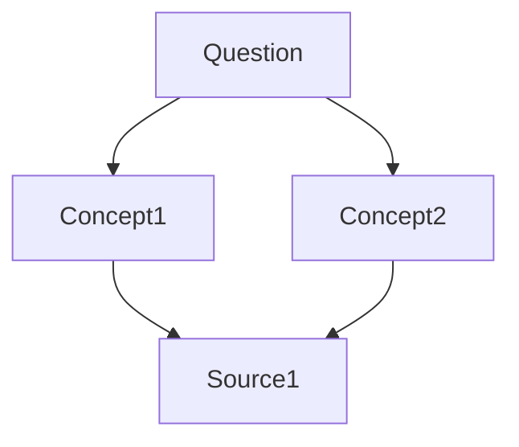

# kb:research

## Purpose

This skill enables conversational Q&A against your knowledge base. Ask research questions and get answers synthesized from your wiki articles, with proper source citations using wikilinks.

## Prerequisites

- A knowledge base with compiled wiki articles
- The `kb` CLI tool installed (for search functionality)
- Access to Claude for synthesis and analysis

## Workflow

### 1. Identify Knowledge Base and Question

Ask the user:
- Which knowledge base to research?
- What is your research question?

### 2. Find Relevant Articles

**A. Search the wiki**

Use the search command to find relevant content:

```bash
kb search <kb_name> "<key_terms_from_question>" \
  --vault-path "~/obsidian-vault/"
```

**B. Check indices**

Read the index files to find relevant articles:
```bash
cat "wiki/_sources.md"
cat "wiki/_index.md"  # If it exists
```

**C. List available articles**

```bash
ls wiki/concepts/
ls wiki/summaries/
ls wiki/topics/
```

### 3. Read Relevant Articles

For each promising article found:

```bash
cat "wiki/concepts/<article-name>.md"
cat "wiki/summaries/<type>/<summary-name>.md"
```

Read:
- Concept definitions
- Source summaries
- Related work sections
- Any existing Q&A outputs

### 4. Synthesize Answer

Generate an answer that:
- Directly addresses the research question
- Cites sources using [[wikilinks]] to wiki articles
- References original sources from `raw/` when appropriate
- Provides context and explanation
- Identifies gaps or areas needing more research
- Uses markdown formatting for clarity

### 5. Ask About Output Format

Ask the user: "How would you like the output?"

Options:
- **Markdown document** - Standard research note
- **Presentation slides** - Bulleted slide format
- **Concept map** - Mermaid diagram showing relationships
- **Just tell me** - Verbal answer only (no file)

### 6. Save Output (If Requested)

Save to the outputs directory:

```bash
# Generate filename from question
outputs/<date>-<question-slug>.md
```

Format the output with proper frontmatter:

```yaml
---
type: research-output
question: "<original_question>"
date: YYYY-MM-DD
sources: ["[[source1]]", "[[source2]]", "[[source3]]"]
---
```

### 7. Offer to File Into Wiki

Ask: "Would you like me to add this to your wiki as a permanent article?"

If yes:
- Convert the output into a topic article or concept article
- Place in appropriate wiki directory
- Add wikilinks to related concepts
- Update indices

## Examples

### Example 1: Simple question
```
User: "What are transformers in ML?"
Assistant: "Let me search your ml-research knowledge base..."

[Searches for "transformers", finds articles on [[attention-mechanism]], [[transformer-architecture]], summary of "Attention Is All You Need"]

"Based on your knowledge base, transformers are a neural network architecture introduced in 'Attention Is All You Need' that relies on [[self-attention]] mechanisms rather than recurrence. Key innovations include:

1. [[Multi-head attention]] - parallel attention layers
2. [[Positional encoding]] - handling sequence order
3. [[Feed-forward networks]] - processing attention outputs

Sources: [[attention-is-all-you-need-summary]], [[transformer-architecture]], [[neural-networks]]

Would you like this saved as a markdown document?"
```

### Example 2: Complex research question
```
User: "How do transformers compare to RNNs for sequence modeling?"
Assistant: [Searches wiki, finds relevant articles, synthesizes comparison]

"I found 3 relevant sources in your knowledge base. Let me synthesize a comparison..."

[Generates detailed comparison with citations]

"How would you like the output?"
User: "Save it as slides"
Assistant: [Generates slide format, saves to outputs/]

"Saved to: outputs/2026-04-16-transformers-vs-rnns.md
Would you like me to add this to your wiki as a topic article?"
```

### Example 3: Gap identification
```
User: "What are the limitations of GPT models?"
Assistant: [Searches, finds limited information]

"I found some discussion in [[transformer-architecture]] and [[attention-mechanism]], but your knowledge base has limited coverage of GPT-specific limitations. Here's what I found:

- [Summary of existing knowledge]

Gaps identified:
- No sources on GPT-3 or GPT-4 specifically
- Limited discussion of hallucination problems
- No coverage of alignment techniques

Would you like me to suggest sources to add?"
```

## Output Formats

### Markdown Document
Standard research note with sections, citations, and wikilinks.

### Presentation Slides
```markdown
# Slide Title

## Slide 1: Overview
- Point 1
- Point 2

## Slide 2: Details
...
```

### Concept Map
````markdown

````

## Notes

### MVP Limitations
- No automatic citation linking (manual wikilink insertion)
- No source ranking or relevance scoring
- No multi-hop reasoning across articles
- No automatic question expansion
- Limited output format options

### Best Practices
- Start broad, then narrow your question
- Review search results before synthesizing
- Cite liberally with [[wikilinks]]
- Identify gaps explicitly
- Save important Q&A outputs to the wiki
- Use descriptive filenames for outputs

### Future Enhancements
- Vector search over wiki embeddings
- Automatic source ranking by relevance
- Multi-hop reasoning across connected concepts
- Question suggestion based on wiki content
- Interactive Q&A with follow-up questions
- Automatic bibliography generation
- Export to Anki flashcards
